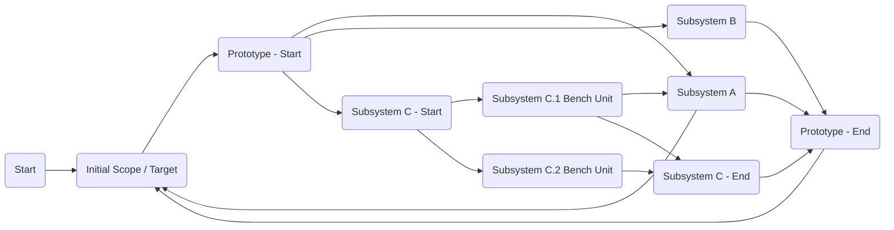
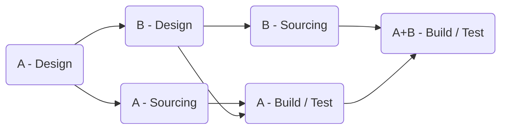

# Hardware Development Path

As you iterate on your product you might call things a Minium Viable Product / MVP or a prototype or beta or even say "it works". The important thing is to understand the context of what you’re doing and/or what you’re trying to do. 

### Minimum Viable Product / Prototype MVP
At very early stages MVPs can be a hand sketch, a photoshop / gimp image, a graphic, a weird stop motion video, a small 3d print, etc. At this early stage you’re trying to get some insightful feedback on what your hypothesis is with a potential customer / user. Youd try to present this on the second call or late into the 1st. 

### TRL & MRL
This corresponds to Technical Readiness Level [^TRL] and Manufacturing Readiness Level[^MRL]. You will see this asked for in government pitches. If we look at both we can see a nice linear road map from duct tape wires and cardboard to a product someone is using. To be clear there is no linear road map. These are levels kind of like a video game you got to burn up some tokens to move forward, but unlike a video game there is no up down left right. They exist to understand where something roughly is, and you can use them as rough measuring stick even if your customer is not a government entity. 

> These aren't typically asked for in an investment pitch, but perhaps they should be. A 3rd CRL customer readiness level would give some good traffic light status to a startup. 

As you go through development you must hit every level. There is no skipping levels and anyone claiming otherwise will be forced to hit them but at a much higher cost. Not all levels take the same amount of time and with proper planning some can go by faster than an outsider might think. 

### Prototypes During Development
Before you get to serving a customer for real. You are going to need to develop multiple prototypes. Some prototypes are internal in that they are to speed up development. Some are external in that they help you get feedback from an early adopter on something that might be blocking or slowing down development, or they help you uncover nonobvious needs of the product. The overarching objective here is to try to get to revenue paying customer with the minimum capabilities set. 

#### Internal Prototypes
For highly multidisciplinary projects (ones with software, electrical, and mechanical) these are key. You need to get to good enough bench units as fast as possible to enable software, electrical, and/or mechanical feedback for iterations and derisking. These can often take the form of just enough hardware/software to validate or test a key sub system(s) while the rest of design moves forward. 

Examples of Subsystem Prototypes:
- An example standup up an 80/20 frame to hold motor and boards to allow software & electrical to iterate while the structure to support the motors was still being designed. 
- Sticking cameras, scanners, a battery, and a computer on a plate and taking that on site visits & customer observations to get sample data sets for evaluating sensing concepts back in the lab. 
- Hacking a micro controller and a led light to fake out software that it connected to a device. Allowing testing of software stack, other devices in the system, and key modes which turn on states in the device that change the led.

Examples of full system prototypes:
- A rough around the edges but working unit. Maybe the cables are too short but are they too short to prevent its use or would it be nice to be longer, but the customer can live with it? Can the customer trial it out and give you some feedback back which makes the system simpler? 
- Standing up a full system as you know of at that moment, but you have found out X takes to long to build or is too fragile to be successful during use. You gain insight into a punch list and can iterate on that. You can also update product cost assumptions. 

#### Testing
In the software world you will read about unit testing, mocking, integration tests, etc. You can do versions of this in hardware particularly at the subsystem level. You should always do it on software. Always try to do some type of sanity check testing at the subsystem level. Trouble shooting and route causing bugs on a full system can be incredibly time consuming. This is one of the areas where moving slow is much faster and cheaper. 

> Testing doesn’t always have to be time consuming. On one project I had a folder of sample images some synthetic, some with edge cases, and some known good. We would run software through these to validate if nothing obvious was broken. Building the test set took some time initially, but the test itself was semi-automated. Tests like these should evolve overtime with the product over time. 

> Basic sanity testing can often answer questions such as do I get intermittent on a wiring harness when I tap, shake bump the sub system? Do the motor still spin the correct direction? Is the software module still doing the basics correctly? Are we in fact sampling data correctly the way we thought or are we having some type of aliasing or Nyquist issue? 

Below is a chart attempting to show some potential links between a bench unit representing a portion of a subsystem and other subsystems in a prototype.

### Never Less Than 3 - Full Systems & Functional Early Systems
Always build at least 3 of these. I once helped a startup that would only build 1 unit and take that to trade shows or send to customers. In reality when building and sourcing parts 3 units doesn’t cost that much more than 1 unit. 

> For a machined part. The tooling setup and programming just to make one is the same amount of time to make two and depending on the part might take more time than just making it. So make at least 3 it might cost 20% - 30%. 

With 3 units you have 1 to send to a customer, 1 to keep in lab for remote support and testing, 1 to use as a spare for a support call. 

With 3 units you have 1 to demo, 1 to keep in the lab for support, and 1 to act as a spare. 

With 3 units you have 1 that can be disassembled in to sub system test mules for the next cycle, 1 that can remain as a functional customer discovery / iteration tool, and 1 to act as a full system bench test unit for software development. 

Having at least 3 keeps your development from grinding to a complete halt when things break (and they will break because that’s R&D). 

### Time Chunking
I try to break topics into weeks. What wins can get that week or two? Float minor topics around that week as needed to support the weeks’ main goal. The main goal moves the project forward and the minor ones give forward motion but aren’t necessary the main schedule driver. 

#### Leapfrogging
Understanding high level sourcing timelines (both custom and off the shelf items) such as these parts are 1 week, these parts 3 weeks, and these parts are 6 weeks can enable laying out schedule wireframes in reverse. This allows for finding opportunities for development / sourcing leapfrogging. 

Regions of systems that are highly coupled (in a once A is done then B can be done) can benefit from focusing on one region, kicking off parts, and pivoting to the other region and kicking those off before the 1st regions parts show up. When this happens, you keep the sourcing thread and the development thread going as in unison as possible. In this way you can somewhat parallelize regions with a serial dependence. 

You can also use leapfrogging with commercial off-the-shelf components. Not everything is 2-day, 7-day delivery, certain sensors can weeks. Uncovering this allows you to know if we think we are going to roughly need ABC on week 4 and it takes 2 weeks to get so order it at end of week 1. 

### Tools
Buy the nice ones you can afford. Those $600-$1000 Molex crimpers. Those are cheaper than the sub $100 ones. The 3d printer which costs $1500. It’s cheaper than the $500 DIY kit. The few $100 bench power supply is cheaper than the $50 amazon one. You can teach a high schooler to make good harnesses with those fancy Molex ones that work. You can also teach your sales, IT guy too, and industrial designer. That $1,500 3d printer, it has auto bed leveling and can print while you sleep without crashing, but that $500 one can't. The expensive power supply doesn't have a spike when you turn it on, is more accurate, and has remote control with the ability to run automated test cycles. 

[^TRL]: [TRL Levels](https://en.wikipedia.org/wiki/Technology_readiness_level)
[^MRL]: [MRL Levels](https://en.wikipedia.org/wiki/Manufacturing_readiness_level)

